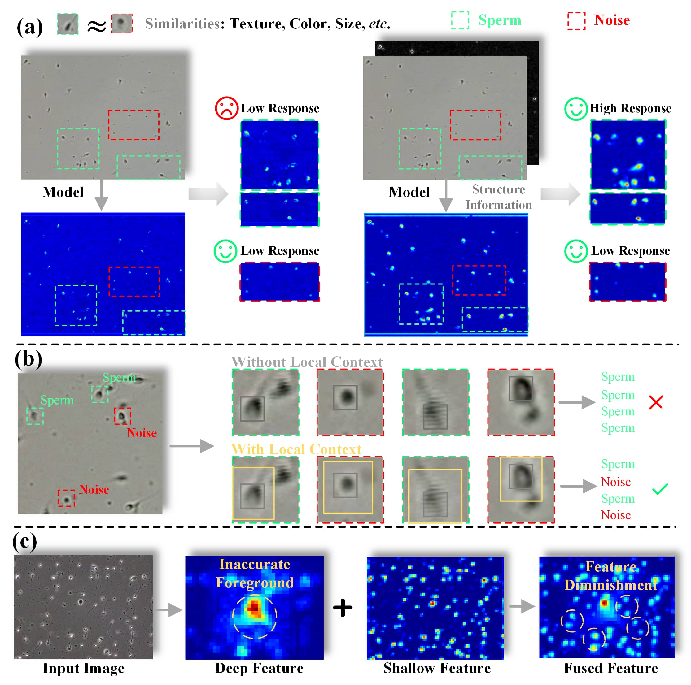
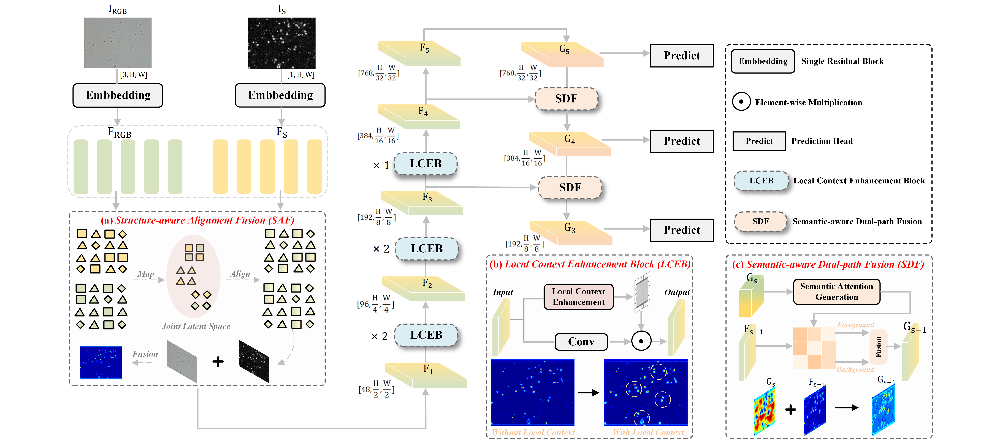
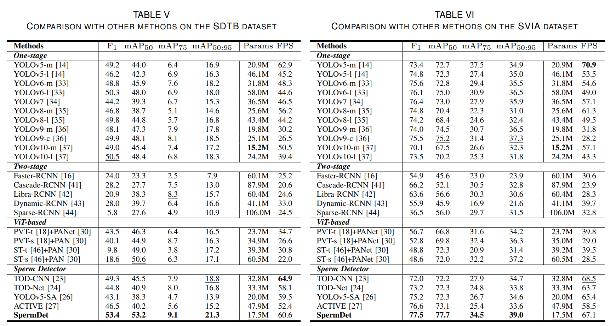
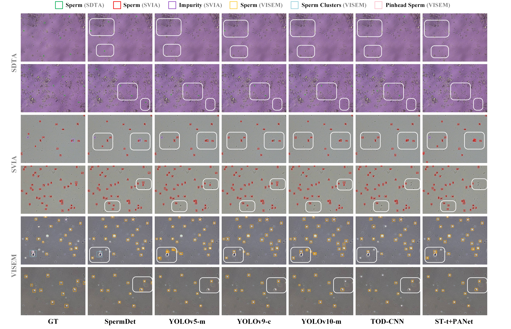

# SpermDet
* Author list: Hongyu Zhang, Zhujun Hu, Huaying Huang, Shuang Liu, Yunbo Rao, Qifei Wang, Naveed Ahmad
* This repository contains the implementation code and proposed SDTB dataset for paper: 
"SpermDet: Structure-aware Network with Local Context Enhancement and Dual-path Fusion for Object Detection in Sperm Images" 
* Accepted by **IEEE Transactions on Instrumentation and Measurement**

## Dataset
The dataset has be made publicly accessible on IEEE DataPort. If you have any question, please contact the following email: Hong-yu-Zhang@outlook.com
```
https://ieee-dataport.org/documents/sdtb-dataset
```

## Motivation
<p align="center">  </p>


## Overview
<p align="center">  </p>

## Installation
```
pip install -r requirements.txt
```

## Usage
### Dataset preparation
The dataset needs to be organized into the YOLO format
```
SDTB/SVIA/VISEM
├── train
│   ├── images
│   └── labels
└── val
|   ├── images
|   └── labels
└── test
    ├── images
    └── labels

```
Specify the dataset path in the config file.
```
data/[dataset_name].yaml
```

### Training
Training command for SDTB.
```
python train.py --img 640 --batch 16 --epoch 100 --data data/gwcc.yaml --cfg models/SpermDet.yaml  --project runs/train/SDTB
```
Training command for SVIA.
```
python train.py --img 416 --batch 16 --epoch 100 --data data/SVIA.yaml --cfg models/Spermdet.yaml  --project runs/train/SVIA
```
Training command for VISEM.
```
python train.py --img 640 --batch 16 --epoch 100 --data data/VISEM.yaml --cfg models/SpermDet.yaml  --project runs/train/VISEM
```
### Testing
```
python val.py --weights [your_path]/weights/best.pt --data data/[dataset_name].yaml --task test --batch-size 1
```

## Performance
<p align="center">  </p>

## Visulization results
<p align="center">  </p>

## Citation
If you find **SpermDet**, please cite our paper:
```
@ARTICLE{10910089,
  author={Zhang, Hongyu and Hu, Zhujun and Huang, Huaying and Liu, Shuang and Rao, Yunbo and Wang, Qifei and Ahmad, Naveed},
  journal={IEEE Transactions on Instrumentation and Measurement}, 
  title={SpermDet: Structure-Aware Network With Local Context Enhancement and Dual-Path Fusion for Object Detection in Sperm Images}, 
  year={2025},
  volume={74},
  number={},
  pages={1-14},
  keywords={Feature extraction;Object detection;Noise;Context modeling;Background noise;Semantics;Visualization;Transformers;Neck;Electronic mail;Computer-aided semen analysis (CASA) system;feature fusion;local context extraction;multimodal image fusion;object detection},
  doi={10.1109/TIM.2025.3544697}}

```
